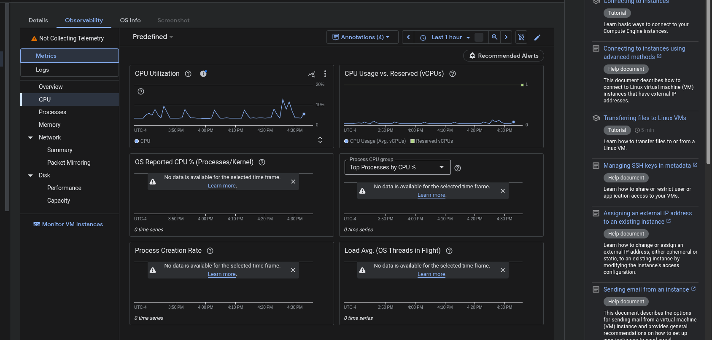

# Website Guessr

Website Guessr is a game where you guess websites from their bare layouts.

## Backend Architecture

The project uses a dual-worker setup on Cloudflare Workers:

- **Filter Worker:** Handles HTML scraping and CSS injection.
- **Randomizer Worker:** Manages game state, multiple-choice options, and D1 database integration.

# database view

Here is what the database looks like on cloudflare. We use cloudflare d1 to store everything.

# Runner under google cloud 

We use a vm, we tried to use google cloud run for scaleability, but we encountered too many issues with that.

The rest of the project is hosted on cloudflare workers/pages. Additionally, we use r2 buckets (basically amazon s3 buckets) to store cached images, so pupeteer does not need to run every time, even after a site has been crawled. 

## Getting Started

### Database Setup
1. Create a D1 database: `wrangler d1 create gsrsites`.
2. Initialize schema: `wrangler d1 execute gsrsites --local --file=backend/randomizer/schema.sql`.

### Running Locally
1. Start the Filter worker: `cd backend/filter && pnpm run dev --port 8787`.
2. Start the Randomizer worker: `cd backend/randomizer && pnpm run dev`.
3. Start the Frontend: `cd frontend && pnpm run dev`.

Refer to [backend/DEPLOYMENT.md](backend/DEPLOYMENT.md) for complete Cloudflare setup and deployment instructions.
